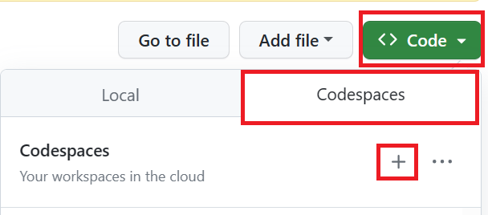
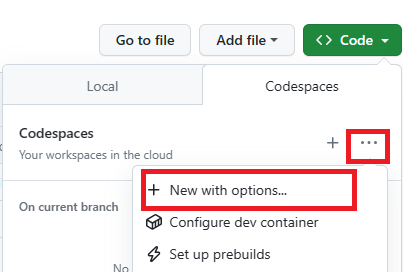
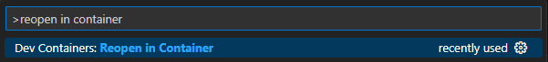
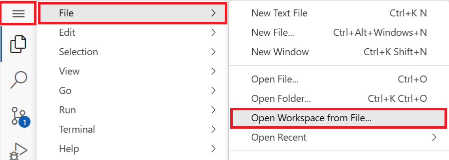
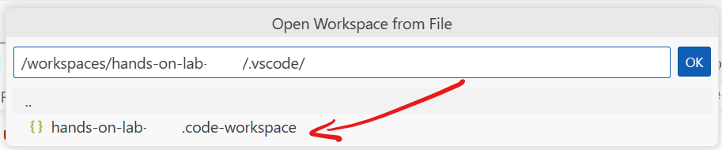
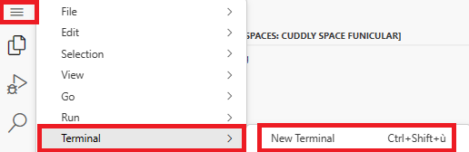
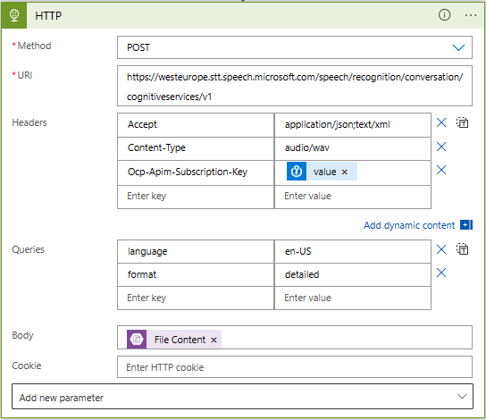
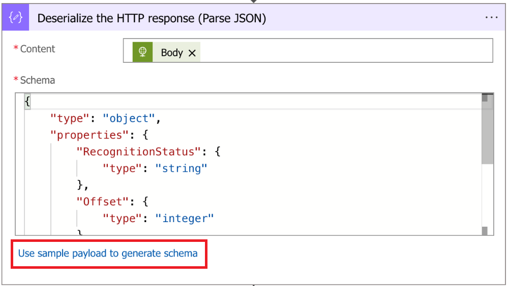
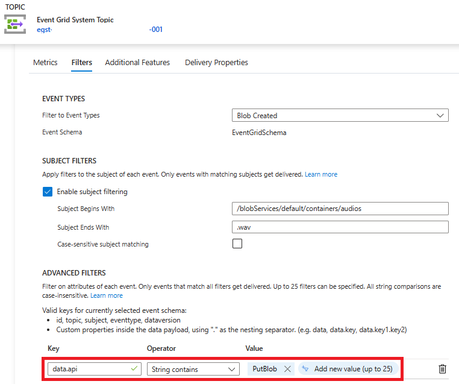

# 🚀 Product Hands-on Lab - Azure Serverless Architecture

Welcome to this Azure Serverless Workshop. You'll be experimenting with Azure Serverless services in multiple labs to achieve a real world scenario. Don't worry, even if the challenges will increase in difficulty, this is a step by step lab, you will be guided through the whole process.

During this workshop you will have the instructions to complete each steps. It is recommended to search for the answers in provided resources and links before looking at the solutions placed under the '📚 Toggle solution' panel.

<div class="warning" data-title="🚀 2 hours version">

> While we strongly believe that **Trial and Error** is an essential part of a practical learning experience, it is probable that you might only have a couple hours in front of you to go through this lab.
> 
> You will find a **FastTrack** version of this product hands-on lab (about 2 hours) to play while getting a grasp on most of the Azure Serverless essential concepts detailed in this lab.
The **FastTrack** required steps will be prefixed with a `🚀` label : These are mandatory for the lab to go forward. 
>
> The 🚀 route will set up most of the infrastructures and connections between resources to help you focus on the application's content and configuration. 
> We also provide instructions for a deep dive session where you'll prefer to configure everything manually via the command line or the Azure Portal. 
> 
> Most of the time, the deep dive path will not cross the 🚀 path, but if this happens, they will be hidden under a [🧑‍💻 Manual Setup] detail panel to avoid confusion with the 🚀 route.
> These [🧑‍💻 Manual Setup] details can be ignored when you browse the 🚀 path.
>
> If you go the 🚀 path, we encourage you to come back and go through the entire lab explanations later to get a deeper understanding of all the concepts described below, from Azure resource choice, to provisioning, application configuration and deployment.
> 
> In a deep dive session, **all of the instructions** being tagged with `🧑‍💻 Manual Setup`, 🚀 (or no tag at all) will be necessary to help you to complete the lab.

</div>

<div class="task" data-title="Task">

> You will find the instructions and expected configurations for each Lab step in these yellow **Task** boxes.
> Inputs and parameters to select will be defined, all the rest can remain as default as it has no impact on the scenario.
>
> Log into your Azure subscription locally using Azure CLI and on the [Azure Portal][az-portal] using your own credentials.
> Instructions and solutions will be given for the Azure CLI, but you can also use the Azure Portal if you prefer.

</div>

## 🚀 Prerequisites

Before starting this lab, be sure to set your Azure environment :

- An Azure Subscription with the **Contributor** role to create and manage the labs' resources and deploy the infrastructure as code
- A dedicated resource group for this lab to ease the cleanup at the end.
- Register the Azure providers on your Azure Subscription if not done yet: `Microsoft.CognitiveServices`, `Microsoft.DocumentDB`, `Microsoft.EventGrid`, `Microsoft.KeyVault`, `Microsoft.Logic`, `Microsoft.SignalRService`, `Microsoft.Web`

To retrieve the lab content :

- A Github account (Free, Team or Enterprise)
- Create a [fork][Repo-fork] of the repository from the **main** branch to help you keep track of your changes

3 development options are available:
  - 🥇 *Preferred method* : Pre-configured GitHub Codespace 
  - 🥈 Local Devcontainer
  - 🥉 Local Dev Environment with all the prerequisites detailed below

<div class="tip" data-title="Tips">

> To focus on the main purpose of the lab, we encourage the usage of devcontainers/codespace as they abstract the dev environment configuration, and avoid potential local dependencies conflict.
> 
> You could decide to run everything without relying on a devcontainer : To do so, make sure you install all the prerequisites detailed below.

</div>

### 🥇 : Pre-configured GitHub Codespace

To use a Github Codespace, you will need :
- [A GitHub Account][github-account]

Github Codespace offers the ability to run a complete dev environment (Visual Studio Code, Extensions, Tools, Secure port forwarding etc.) on a dedicated virtual machine. 
The configuration for the environment is defined in the `.devcontainer` folder, making sure everyone gets to develop and practice on identical environments : No more conflict on dependencies or missing tools ! 

Every Github account (even the free ones) grants access to 120 vcpu hours per month, _**for free**_. A 2 vcpu dedicated environment is enough for the purpose of the lab, meaning you could run such environment for 60 hours a month at no cost!

To get your codespace ready for the labs, here are a few steps to execute : 
- After you forked the repo, click on `<> Code`, `Codespaces` tab and then click on the `+` button:



- You can also provision a beefier configuration by defining creation options and select the **Machine Type** you like : 



### 🥈 : Using a local Devcontainer

This repo comes with a Devcontainer configuration that will let you open a fully configured dev environment from your local Visual Studio Code, while still being completely isolated from the rest of your local machine configuration : No more dependancy conflict.
Here are the required tools to do so : 

- [Git client][git-client] 
- [Docker Desktop][docker-desktop] running
- [Visual Studio Code][vs-code] installed

Start by cloning the Hands-on-lab-Serverless repo you just forked on your local Machine and open the local folder in Visual Studio Code.
Once you have cloned the repository locally, make sure Docker Desktop is up and running and open the cloned repository in Visual Studio Code.  

You will be prompted to open the project in a Dev Container. Click on `Reopen in Container`. 

If you are not prompted by Visual Studio Code, you can open the command palette (`Ctrl + Shift + P`) and search for `Reopen in Container` and select it: 



### 🥉 : Using your own local environment

The following tools and access will be necessary to run the lab in good conditions on a local environment :  

- [Git client][git-client] 
- [Visual Studio Code][vs-code] installed (you will use Dev Containers)
- [Azure CLI][az-cli-install] installed on your machine
- [Azure Functions Core Tools][az-func-core-tools] installed, this will be useful for creating the scaffold of your Azure Functions using command line.
- If you are using VS Code, you can also install the [Azure Function extension][azure-function-vs-code-extension]
- The 3 following languages if you want to run all the Azure Functions solutions : 
  - [.Net 7][download-dotnet]
  - [Python 3.x][download-python]
  - [Node 18][download-node]

Once you have set up your local environment, you can clone the Hands-on-lab-serverless repo you just forked on your machine, and open the local folder in Visual Studio Code and head to the next step. 

### 👉 All : Load the Workspace

Once your environment is ready, you will have to enter the Visual Studio Workspace to get all the tools ready.
To do so, click the **burger menu** in the top left corner (visible only with codespace), **File** and then **Open Workspace from File...** 



- Select `.vscode/hands-on-lab-serverless.code-workspace` :



- You are now ready to go! For the rest of the lab, in case you lose the terminal, you can press `Ctrl + J` or open a new one here : 



Let's begin!

### 🔑 All : Sign in to Azure

<div class="task" data-title="Task">

> - Log into your Azure subscription in your environment using Azure CLI and on the [Azure Portal][az-portal] using your credentials.
> - Instructions and solutions will be given for the Azure CLI, but you can also use the Azure Portal if you prefer.
> - Register the Azure providers on your Azure Subscription if not done yet: `Microsoft.Web`, `Microsoft.OperationalInsights`, `Microsoft.Cache`, `Microsoft.ApiManagement`, `Microsoft.DocumentDB`

</div>

<details>

<summary>📚 Toggle solution</summary>

```bash
# Login to Azure : 
# --tenant : Optional | In case your Azure account has access to multiple tenants

# Option 1 : Local Environment 
az login --tenant <yourtenantid or domain.com>
# Option 2 : Github Codespace : you might need to specify --use-device-code parameter to ease the az cli authentication process
az login --use-device-code --tenant <yourtenantid or domain.com>

# Display your account details
az account show
# Select your Azure subscription
az account set --subscription <subscription-id>

# Register the following Azure providers if they are not already

# Azure Cognitive Services
az provider register --namespace 'Microsoft.CognitiveServices'
# Azure CosmosDb
az provider register --namespace 'Microsoft.DocumentDB'
# Azure Event Grid
az provider register --namespace 'Microsoft.EventGrid'
# Azure Key Vault
az provider register --namespace 'Microsoft.KeyVault'
# Azure Logic Apps
az provider register --namespace 'Microsoft.Logic'
# Azure Web PubSub
az provider register --namespace 'Microsoft.SignalRService'
# Azure Functions
az provider register --namespace 'Microsoft.Web'
```

</details>

## Scenario

The goal of the full lab is to upload an audio file to Azure and retrieve the transcripts back using a Web Application.

Here is a diagram to illustrate the flow:


1. You will open the demo web application which sends an HTTP GET request to APIM (API Management) to fetch existing transcriptions. APIM will be used as a facade for multiple APIs.
1. The request is forwarded from APIM to an Azure Function endpoint handling transcription fetching
1. This Azure Function endpoint retrieves the latest transcriptions stored in Cosmos DB, and returns them to the web application
1. You will then upload an [audio file](assets/whatstheweatherlike.wav) in the web application interface
1. The web application sends an HTTP request to APIM
1. An Azure Function endpoint handling uploads will process the request and upload the file to a Storage Account
1. When the file is uploaded the Event Grid service will detect it and publish the "Blob created event"
1. The Event Grid System Topic will trigger a Logic App
1. The Logic App retrieves the uploaded audio file
1. The audio file is sent to Azure Cognitive Services via the Logic App Workflow. The speech to text cognitive service will process the file and return the result to the Logic App
1. The Logic App Workflow will then store the transcript of the audio file in a Cosmos DB Database
1. Another Azure Function endpoint will be triggered by the update event in CosmosDB.
1. The Azure Function will then fetch the transcript from CosmosDB and publish it to Web Pub/Sub
1. The web application being a subscriber of the Web Pub-Sub resource, it will be notified about the new transcript being added via a websocket and display it in the list.

<div class="info" data-title="Note">

> Azure Key Vault will be used to secure the secrets used through the entire scenario.

</div>

You will get more details about each of these services during the Hands On Lab.

## Naming conventions

Before starting to deploy any resource in Azure, it's important to follow a naming convention to ensure resource name uniqueness and ease their identification. Based on the official [documentation][az-naming-convention] you need to define a few things:

- The application name
- The environment
- The region
- The instance number

You will also add an owner property, so for the purpose of this lab the values will be:

- The service prefix: `func` (for Azure Function)
- The environment: `dev`
- The region: `we` (for West Europe)
- The application name: `hol` (for Hands On Lab)
- The owner: `ms`
- The instance: `01`

You will use this convention for the rest of the scenario:

```xml
<!--If the resource prefix has a dash: -->
<service-prefix>-<environment>-<region>-<application-name>-<owner>-<instance>
<!--If the resource does not autorize any special caracters: -->
<service-prefix><environment><region><application-name><owner><instance>
```

<div class="info" data-title="Note">

> Be sure to use **your own values** to have unique names or use your own convention.
> [Official resource abbreviations][az-abrevation]
>
> Some services like Azure Storage Account or Azure KeyVault have a maximum size of 24 characters, so please consider using relevant abbreviations as small as possible.

</div>

## Programming language

You will have to create few functions in this workshop to address our overall scenario. You can choose the programming language you are the most comfortable with among the ones [supported by Azure Functions][az-func-languages]. We will provide examples in Python and .NET 7 (isolated) for the moment, but other languages might be added in the future.

With everything ready let's start the lab 🚀

[az-cli-install]: https://learn.microsoft.com/en-us/cli/azure/install-azure-cli
[az-func-core-tools]: https://learn.microsoft.com/en-us/azure/azure-functions/functions-run-local?tabs=v4%2Clinux%2Ccsharp%2Cportal%2Cbash#install-the-azure-functions-core-tools
[az-func-languages]: https://learn.microsoft.com/en-us/azure/azure-functions/functions-versions#languages
[az-naming-convention]: https://learn.microsoft.com/en-us/azure/cloud-adoption-framework/ready/azure-best-practices/resource-naming
[az-abrevation]: https://learn.microsoft.com/en-us/azure/cloud-adoption-framework/ready/azure-best-practices/resource-abbreviations
[az-portal]: https://portal.azure.com
[vs-code]: https://code.visualstudio.com/
[azure-function-vs-code-extension]: https://marketplace.visualstudio.com/items?itemName=ms-azuretools.vscode-azurefunctions
[docker-desktop]: https://www.docker.com/products/docker-desktop/
[Repo-fork]: https://github.com/microsoft/hands-on-lab-serverless/fork
[git-client]: https://git-scm.com/downloads
[github-account]: https://github.com/join
[download-dotnet]: https://dotnet.microsoft.com/en-us/download/dotnet/7.0
[download-python]: https://www.python.org/downloads/
[download-node]: https://nodejs.org/en

---

# Lab 0 : The Web Application (1 hour)

## Create a resource group (5 min)

Let's start by creating the resource group for this Hand's On Lab. The resource group is a logical structure to store Azure components used to group your Azure resources.

Remember, the naming convention for a resource groups will be: `rg-<environment>-<region>-<application-name>-<owner>-<instance>`

<div class="task" data-title="Tasks">

> - Create a `resource group` in the region of your choice.

</div>

<div class="tip" data-title="Tips">

> For the purpose of this lab you will create all the resources in the same region, for instance `France Central` (francecentral) or `West Europe` (westeurope).
> It's important to note that Static Web App built-in api isn't available in `France Central` at the moment of the lab creation : You can still create the rest in France Central, this won't affect the rest of the labs.
>
> [Resource Groups][resource-group]

</div>

<details>
<summary>📚 Toggle solution</summary>

```bash
# Use az account list-locations to get a location:

az account list-locations -o table

# Then create the resource group using the selected location:

az group create --name <resource-group> --location <region>
```

</details>

## Web App Portal (55 min)

You have created a Static Web App to help assess progress on this Hands-on-Lab and make it easier to upload and get back transcriptions using a simple web interface.


Deploying the Web App is optional but it is highly recommended as it will simplify the testing process so that you can focus on the fun stuff.

You can deploy the [demo Web App][github-demo-web-app] using either Github Actions (recommended) or [Azure Static Web Apps CLI][swa-cli].

Remember to define a naming convention, for a static web app it will be this format: `stapp-<environment>-<region>-<application-name>-<owner>-<instance>`

### Using Github Actions

You can rely on Github Actions to build and deploy the code of the Web app into a Static Web App in Azure.

To do this, you need to [fork the project][github-hol-fork] on Github and then run the following command:

```sh
# Replace the following settings with your own:
# - <unique-web-app-name>: unique Static Web App name
# - <github-username> : your username or organisation in Github where you forked the project
# - <resource-group> : name of your resource group
# - westeurope : you can use a different location if you want to deploy the web app somewhere else. Static Web App might not be available in every Azure Region but selecting another one that the default defined above will not be an issue for the rest of the lab. 

az staticwebapp create \
    --name <unique-web-app-name> \
    --resource-group <resource-group> \
    --source https://github.com/<github-username>/hands-on-lab-serverless \
    --location "westeurope" \
    --branch main \
    --app-location "./src/webapp"  \
    --api-location "./src/webapp/api"  \
    --output-location "build" \
    --login-with-github
```

This command will create the Static Web App in Azure and will then prompt you for permissions in Github so that it can add a Github Action to your forked project. This action will then build and deploy the code of the static web app on your behalf.

### Using Azure Static Web Apps CLI

You can also opt for building and deploying the web app from your machine without having to fork the project and give permissions to [AzureAppServiceCLI][app-service-cli] to access the code.

First let's [download][webapp-zip] or clone the [project][github-hol] locally and go inside the `src/webapp` folder.

Now, you can follow these steps to create the static web app:

```sh
# 1. Create the Static Web App in Azure
# Replace the following settings with your own:
# - <unique-web-app-name>: unique Static Web App name
# - <resource-group> : name of your resource group
# - westeurope : you can use a different location if you want to deploy the web app somewhere else

az staticwebapp create \
    --name <unique-web-app-name> \
    --resource-group <resource-group> \
    --location "westeurope"

# 2. Go to the root of the downloaded app and install project dependencies
# You need to have NodeJS 18 installed
npm install

# 3. Build the Web App
npm run swa:build

# 4. Deploy the web app code into the Static Web App
# Replace <resource-group> with the name of your resource group
# Back to the root repository
npm run swa:deploy -- \
  --resource-group <resource-group> \
  --app-name <unique-web-app-name> \
  --no-use-keychain
```

Et voila, now you should have a running demo Web App 🚀
It is pretty much a blank canvas at this stage, but you will soon be able to add new features to it as you progress with the lab.

[resource-group]: https://learn.microsoft.com/fr-fr/cli/azure/group?view=azure-cli-latest
[github-demo-web-app]: https://github.com/microsoft/hands-on-lab-serverless/tree/main/src/webapp
[swa-cli]: https://aka.ms/swa/cli-local-development
[github-hol-fork]: https://github.com/microsoft/hands-on-lab-serverless/fork
[app-service-cli]: https://learn.microsoft.com/en-us/azure/static-web-apps/get-started-cli?tabs=react
[github-hol]: https://github.com/microsoft/hands-on-lab-serverless
[webapp-zip]: https://github.com/microsoft/hands-on-lab-serverless/releases/download/latest/webapp.zip

---

# 🚀 Lab 1 : Transcribe an audio file (3 hours)

For this first lab, you will focus on the following scope :


## Create the storage (5 min)

The Azure storage account is used to store data objects, including blobs, file shares, queues, tables, and disks. You will use it to store the audios files inside an `audios` container.

With the resource group ready, let's create a storage account with a container named `audios` that will store all audios. The naming convention for a Storage Account is: `st<environment><region><application-name><owner><instance>`.

<div class="task" data-title="Tasks">

> - Create a locally redundant storage account (`Standard LRS`).
> - Once the storage account is ready, create a blob container named `audios` with `private access`.

</div>

<div class="tip" data-title="Tips">

> Azure Storage Account names do not accept hyphens and cannot exceed a maximum of 24 characters.
> [Storage Account][storage-account]<br>
> [Storage Account Container][storage-account-container]

</div>

<details>
<summary>📚 Toggle solution</summary>

```bash
# Create the Storage Account with Standard LRS

az storage account create -n <storage-account-name> \
                          -g <resource-group> \
                          -l <region> \
                          --sku Standard_LRS
```

Based on the command line below, to create the container for the audio files you need to get an access key:


```bash
# Then create the audios container inside it

az storage container create -n audios \
                            --account-name <storage-account-name> \
                            --account-key <storage-account-key>
```

To check everything was created as expected, open the [Azure Portal][az-portal] and you should retrieve your container:


</details>

## Detect a file upload event (25 min)

### Events services

Serverless is all about designing the application around event-driven architectures. Azure offers several options when it comes to message and event brokering, with the principal following services :

- Event Grid is a `serverless` eventing bus that enables event-driven, reactive programming, using the publish-subscribe model.
- Service Bus is a fully managed enterprise `message broker` with message queues and publish/subscribe topics.
- Event Hub is a big data streaming platform and event ingestion service. It can receive and process millions of events per second.

<div class="info" data-title="Note">

> Each of these services offer their own set of capabilities and will be preferred depending on the expected architecture design and requirements.
> You can find a detailed article which compares the pros and cons of each of these solutions [following this link][azure-messaging-services]

</div>

Event Grid is an event broker that you can use to integrate applications while subscribing to event sources. These events are delivered through Event Grid to subscribers such as applications, Azure services, or any accessible endpoint. Azure services, First and Third-party SaaS services as well as custom applications can be the source of these events.

### 🚀 Create the Event Grid System Topic

The main Event Grid concept we'll use for the rest of this lab is called `System Topic`. A system topic in Event Grid represents one or more events published by Azure services such as Azure Storage and Azure Event Hubs. It basically plays the role of a pub-sub topic centralizing all the events of the associated Azure resource, and send them to all `subscribers` based on their defined `event filters` defined in specific `Event subscriptions`.

You will now have to link the audios' storage you just created (named like `st<environment><region><application-name><owner><instance>`) with an Event Grid **System Topic**. 

Here are the main options to create Event Grid System Topics:

1. Directly from the resource you want to monitor using the `Events` menu. A system topic will be created automatically with a unique name and will be linked to the resource. You will have to create an `Event Subscription` via this method.
1. Manually, using the `Event Grid System Topics` resource type in the Azure Portal, or thanks to the Azure CLI. This will allow you to define the name of the system topic and the resource it will be linked to. `Event Subscription` **not required** at the creation of the resource with this method.

For this step, creating the Event Grid System Topic will be enough, as the actual `event subscription` and `event filters` will be defined and automatically created by the Logic App trigger setup [later on](workshop/serverless-overview/?step=1#trigger-the-logic-app).

<div class="task" data-title="Tasks">

> **Manually** Create an Event Grid System Topic with the following parameters :
>
> - Topic type : `Microsoft.Storage.StorageAccounts`
> - Source : The name of the storage account created in the previous steps
> - Location : Must be the same location as the storage account
> - Do not create any `event subscription` yet.

</div>

The naming convention for an Event Grid System Topic is: `egst-audio-storage-<environment>-<region>-<application-name>-<owner>-<instance>`

<div class="tip" data-title="Tips">

> To get access to the identifier of a resource, go to the `Overview` tab and click on `Json View` on the top right and you will see it.
>
> [Choose between Azure Messaging Services][azure-messaging-services]<br> 
> [Event Grid System Topic][event-grid-system-topic]<br> 
> [Event Grid Topic Subscription][event-grid-topic-subscription] 

</div>

<details>

<summary>📚 Toggle solution</summary>

To create an Event Grid System Topic, several parameters are mandatory :

- `--topic-type` must be set to the `type` of resource raising the events (`microsoft.storage.storageaccounts` in our lab)
- `--source` will define the actual Azure `resource` from which you want to centralize the events (The Storage account in our lab)
- `--location` must be the same as the source resource.

```bash
# Create the event grid system topic
az eventgrid system-topic create \
  -g <resource-group> \
  --name <event-grid-system-topic-name> \
  --topic-type microsoft.storage.storageaccounts \
  --source /subscriptions/<subscription-id>/resourcegroups/<resource-group>/providers/Microsoft.Storage/storageAccounts/<storage-account-name> \
  --location <region>
```

Now you should see the Event Grid System Topic in your Resource Group :


</details>

## Process the event (1 hour 30 min)

You'll now build a Logic App workflow that will be triggered when a blob is uploaded to the storage account created earlier.
This section of the Lab will describe all the steps that the Logic App will take to address this scenario :


### Create the Logic App

Azure Logic Apps is an integration platform as a service where you can create and run automated workflows with little to no code. The design of Logic Apps is mainly designer oriented, and a visual designer can be used to compose a workflow with prebuilt operations which can quickly build a workflow that integrates and manages your apps, data, services, and systems. While creating and testing a flow is way easier with the help of the designer, it still gives capabilities to export the resulting flow as a JSON `template` file to enable versioning, DevOps CI/CD or separate environment requirements.

Logic Apps offers two main hosting plans which currently differ in functionalities: consumption (multi-tenant) and standard (single-tenant):

- `Standard` mode is a dedicated hosting environment (single-tenant) for which resource allocation (CPU/RAM) will be selected at the creation of the resource. This option will let you build different various workflows in the same resource (dedicated capacity) as long as it has enough resources allocated to execute them. This model is billed at a fixed hourly/monthly rate regardless of its actual usage.
- `Consumption` is the serverless option for Logic Apps and will be the fastest way to start with Logic Apps workflow. This model will let you design one workflow per resource and will make sure necessary resources are available for any parallel executions. As a rule of thumb, a Logic Apps workflow in consumption will be billed based on the actual number of executions as well as the overall number of actions (aka building blocks) that compose it.

<div class="task" data-title="Tasks">

> - Create a Logic Apps resource in `consumption` mode
> - In this logic apps resource, create a `blank` template workflow

</div>

The naming convention for Logic Apps is: `logic-<environment>-<region>-<application-name>-<owner>-<instance>`

<div class="tip" data-title="Tips">

> If you decide to create the logic app via the Az CLI, here is the `definition template` to save locally in a JSON file named `my-blank-template.json` .
>
> ```json
{
  "definition": {
    "$schema": "https://schema.management.azure.com/providers/Microsoft.Logic/schemas/2016-06-01/workflowdefinition.json#",
    "actions": {},
    "contentVersion": "1.0.0.0",
    "outputs": {},
    "parameters": {},
    "triggers": {}
  },
  "parameters": {}
}
> ```
> [Azure CLI Extension][azure-cli-extension]<br> 
> [Azure Logic App][azure-logic-app]

</div>

<details>
<summary>📚 Toggle solution</summary>

```bash

# Install the Logic App extension for Azure CLI
az extension add --name logic

# Create a logic app in consumption mode
az logic workflow create --resource-group <resource-group> \
                         --location <region> \
                         --name <logic-app-name> \
                         --definition <path-to-default-workflow.json>

```

</details>

### 🚀 Trigger the Logic app

Next step is to actually trigger the Logic App you just created (`logic-<environment>-<region>-<application-name>-<owner>-<instance>`) based on the event raised by your Event Grid System Topic when a file is uploaded to the audios' container.

Azure Logic Apps offers different components which can be used to define the `steps` of a flow as a chain of `actions` and `controls`. Here are the main ones :

- Operations : `Triggers` and `Actions` are the main building blocks of a Logic App. A `trigger` is the event that starts the workflow and an `action` is a step in this workflow.
- Controls : Switch, Loop, Condition, Scope are used to control the flow of the steps composing the actual logic of the workflow.
- Connectors : Standard and Enterprise connectors are used to connect to different first of third party services and applications. These connectors abstract the complexities of interacting with these services by defining their required and optional inputs as well as deserializing their outputs to `dynamic objects` usable in the rest of the flow steps.

Here's an example of a basic use case:


And this how this flow would look like in Logic Apps :


Back to our Logic App, let's start with our first step :

You will use the `Event Grid` connector to `trigger` the Logic App when a file is uploaded to the storage account `audios` container.


This workflow will subscribe to the `Blob created event` raised and passed on by an Event Grid `subscription` to the `System Topic` created earlier.

While you create this trigger, you will be asked to provide the actual resource or System Topics' details that will be used to trigger the Logic App.
In our case, select and connect to the `Storage account` created earlier.

Then define the actual conditions you want to meet to trigger the Logic App.

<div class="task" data-title="Tasks">

> - Add an Event Grid `trigger` to your Logic Apps Workflow 
> - Configure the trigger to react to events on the Storage account you created
> - Filter the trigger to run only on : 
>   - `blob created` events
>   - Files uploaded in the `audios` container 
>   - Files with the `.wav` extension

</div>

The naming convention for Event Subscription is: `evgs-audios-uploaded-<environment>-<region>-<application-name>-<owner>-<instance>`

<div class="info" data-title="Note">

> While saving the Logic Apps trigger settings, the Event Grid connector will actually create a new Event Grid subscription to the System Topic created earlier. You can check this by navigating to the Event Grid System Topic in the Azure Portal and checking the `Event Subscriptions` tab :
> 

</div>

Here you can download a basic audio file to validate and test the logic app triggers as expected: [Audio demo](assets/whatstheweatherlike.wav).

If you have set everything as expected, you should see the following entry in the Logic App's run history after uploading the example file in your storage account audios container :


<div class="tip" data-title="Tips">

> [Logic Apps Event Grid Trigger][logic-apps-event-grid-trigger]<br> 
> [Event Grid Subject Filter][event-grid-subject-filtering]

</div>

<details>
<summary>📚 Toggle solution</summary>

In the [Azure Portal][az-portal] inside the Logic App just created click on the `Edit` button. Then select `Blank Logic App`. In the triggers list search for `Event Grid` and select the `When a resource event occurs` trigger.

You will then select your `Azure Subscription`, `Microsoft.Storage.StorageAccounts` as a Resource Type and the actual storage account created earlier.

Next step would be to configure the event type you want to listen to. In our case, you will select `Blob created` as the event type Item.

Parameters below will help in filtering the events you want to listen to. In our case, you will filter on the `audios` container, and the `.wav` file extension.
The convention to filter on a specific blob container is as follows : `/blobServices/default/containers/<container-name>`.

Finally, set the Event Grid `Subscription Name` to `evgs-audios-uploaded-<environment>-<region>-<application-name>-<owner>-<instance>` this will be automatically created for you.

Once everything is set, click on the `Save` button on the top left corner and the trigger operation should look like this :


It is also possible to rename the different operations of your Logic App to make it easier to read and understand. To do so, click on the `...` button on the top right corner of the block and select `Rename`.


</details>


### 🚀 Retrieve file content

Now you have a blob upload event triggering the Logic App, you will be able to work with extended `metadata` shared in the event message.

<div class="info" title="Note">

> It's important to note that an event grid event message is limited to 1MB per event, thus it will not provide the actual content of the file uploaded to the storage account. Instead, it will contain the path to the file in the storage account. This is why you need to use the `Get blob content` action to retrieve the actual content of the file.

</div>

One of the event fields is the `subject` which is the path to the event source : The uploaded file in the storage account.
To make the flow design easier, it is possible to provide a sample json payload string and Logic Apps will automatically generate a more convenient object to manipulate in the rest of the flow design.

Event Grid will communicate events based on a common schema by default, that can be found [here][event-grid-common-schema].
As the Event Grid Trigger is an operation built-in in Logic Apps, the designer is already taking care of this JSON parsing operation for us and provides with a well defined object to work with as `Dynamic Content` for the rest of the flow.

This will help us to retrieve the actual content of the file and pass it on to the cognitive service in the next step.


Based on below resources and the previous definition step, you should be able to complete this task.

<div class="task" data-title="Tasks">

> Add a `Get Blob Content v2` step in the workflow after the trigger 

</div>


<div class="tip" data-title="Tips">

> To help you troubleshoot the flow, you can use the `Run History` tab and check the `Inputs` and `Outputs` of each operation :
> 
>
> [Logic Apps Parse Json][logic-app-parse-json]<br> 
> [Logic App Storage Account Action][logic-app-storage-action]

</div>

<details>
<summary>📚 Toggle solution</summary>

First of all, add a new step after the Event Grid trigger and search for `Azure Blob Storage` as an action. Select `Get blob content (V2)` as the action to use.

This operation needs to be parameterized with the authentication information to access the storage account.

In the `Connection Name` field, fill in with `StorageAccountConnection`.

Select the `Access Key` authentication method and set the name of the `Storage Account name` created earlier.

Finally, retrieve the `Primary Key` from your Storage Account `Access keys` panel and fill in the `Access Key` field and click `Create`.


Now select the `Get blob content (V2)` action and select the connection settings you configured above.

Then, as the Event Grid Trigger operation already takes care of the JSON parsing, you can directly use the `subject` field as input for the `Blob` field.
While clicking on the `Blob` field you should be presented with a list of `Dynamic content` available. These will be updated based on the previous steps known by the action being edited.

Update the `Blob` field with the path of the audio file extracted from the event grid `data.url` property thanks to the `uriPath` function:

```js

// This will extract the path from the uri provided as an input
// It's important to make sure the Event Grid trigger output is recognized as dynamic content in the interface before using it in the formula field
uriPath(triggerBody()?['data']?['url'])
```

`uriPath()` will extract the path from a uri provided as an input, in our example `https://<storage-account>.blob.core.windows.net/audios/whatstheweatherlike.wav` will become `audios/whatstheweatherlike.wav`.

Your Logic App should look like this:


</details>

### 🚀 Consume Speech to Text APIs

The Azure Cognitive Services are cloud-based AI services that give the ability to developers to quickly build intelligent apps thanks to these pre-trained models. They are available through client library SDKs in popular development languages and REST APIs.

Cognitive Services can be categorized into five main areas:

- Decision : Content Moderator provides monitoring for possible offensive, undesirable, and risky content. Anomaly Detector allows you to monitor and detect abnormalities in your time series data.
- Language : Azure Language service provides several Natural Language Processing (NLP) features to understand and analyze text.
- Speech : Speech service includes various capabilities like speech to text, text to speech, speech translation, and many more.
- Vision : The Computer Vision service provides you with access to advanced cognitive algorithms for processing images and returning information.
- Azure OpenAI Service : Powerful language models including the GPT-3, GPT-4, Codex and Embeddings model series for content generation, summarization, semantic search, and natural language to code translation.

To access these APIs, create a `cognitive service` resource in your subscription. This will instantiate a resource with an associated `API Key` necessary to authenticate the API call owner and apply rate and quota limits as per selected pricing tier.

You now want to retrieve the transcript out of the audio file uploaded thanks to the speech to text cognitive service.


<div class="task" data-title="Tasks">

> To do this, you will have to:
>
> - `🧑‍💻 Manual Setup` : Instantiate the cognitive service as a `Free` tier
> - Retrieve your auto-generated `Api Key`
> - Call the speech to text API

</div>

<div class="important" data-title="Security">

> Remember to store secrets as connection strings and `Api keys` in an Azure Key Vault to manage and secure their access.

</div>

The naming conventions are:

- Cognitive services: `cog-<environment>-<region>-<application-name>-<owner>-<instance>`
- Key Vault: `kv-<environment>-<region>-<application-name>-<owner>-<instance>`

<div class="tip" data-title="Tips">

> [What are Cognitive Services][cognitive-services]<br> 
> [Cognitive service Az CLI][cognitive-services-cli]<br> 
> [Cognitive Service Getting Started][cognitive-service-api]<br> 
> [Create a Key Vault][key-vault]

</div>

<details>
<summary>📚 Toggle solution</summary>

<details>
<summary>🧑‍💻 Manual Setup</summary>

```bash
# Let's create the speech to text service account as free tier
az cognitiveservices account create -n <cognitive-service-name> \
                                    -g <resource-group> \
                                    --kind SpeechServices \
                                    --sku F0 \
                                    -l <region> --yes
# Create the Key Vault to secure the speech to text API key
az keyvault create --location <region> \
                   --name <key-vault-name> \
                   --resource-group <resource-group>
```

To allow the Logic App to access the Key Vault, you need to grant access to it. Go to your Logic App and inside the identity tab, turn on the `System Identity`:


Then in your Key Vault, go to `Access policies` and create a new one, set the Secret access to `Get` and `List`:


Then search for your logic app.


Now inside your Key Vault, in the `Secret` section add a new one called `SpeechToTextApiKey` and set a key from the cognitive service.

If you can't add the secrets, this means that you need to give to the account you are using, access to the Key Vault like you did previously with Logic App. So, in your Key Vault, go to `Access policies` and create a new one, set the Secret access to `Get`, `List` and `Set`.


</details>

With all the pre-requisites set (Key Vault **created**, secret Cognitive Service api key **set**, Logic App Managed Identity access to key vault **enabled**), add a new action in your **logic app workflow** by searching for `Key Vault` and then select `Get Secret`. This will load the speech to text API key once.


Select the Key Vault resource and the name of the secret.


Next, add a new action by searching for `Http`, then fill in the different parameters as follows after retrieving the cognitive service endtpoint from the **resource overview**:



Notice the region of your cognitive service account and the language to use are specified in the API Url. All parameters can be found in the default [sample][default-cognitive-sample]

To validate the flow, go to your storage account and delete the audio file from the `audios` container and upload it once again (to trigger the updated logic app).
In the Logic App `Run History`, you should see the transcript of the audio file as a text output from the HTTP call to Speech to Text API.

<!-- TODO: Add a screenshot -->

</details>

### 🚀 Store data to Cosmos DB

Azure Cosmos DB is a fully managed NoSQL database which offers Geo-redundancy and multi-region write capabilities. It currently supports NoSQL, MongoDB, Cassandra, Gremlin, Table and PostgreSQL APIs and offers a serverless option which is perfect for our use case.

Now the cognitive service provided with a transcript of your audio file, you will have to store it in a NoSQL database inside Cosmos DB.
The naming convention for Cosmos DB account is `cosmos-<environment>-<region>-<application-name>-<owner>-<instance>`


<details>
<summary>🧑‍💻 Manual Setup</summary>
<div class="task" data-title="Tasks">

> - Create a Cosmos DB account and select the `NoSQL` API
> - Set the Capacity Mode to `Serverless`
> - Create a database named : `HolDb`
> - Add a new collection to store the transcripts : `audios_transcripts`
</div>

</details>

Now you can add the last step of the Logic App flow that will store the transcript in the Cosmos DB database using the `Create or update document V3` operation. Once again, the action will help you set the connection to the cosmos DB collection and ease the insert/update operations by providing a JSON schema.

<div class="task" data-title="Tasks">

> Add a `Parse JSON` action in your Logic App Workflow 
> Store the JSON object in the Cosmos DB container via a `Create or update Document` action

</div>


<div class="tip" data-title="Tips">

> [Serverless Cosmos DB][cosmos-db]<br>
> [Parse JSON action][logic-app-action-parse-json]<br>
> [Logic App Cosmos DB action][logic-app-cosmos-db-action]

</div>

<details>
<summary>📚 Toggle solution</summary>

<details>
<summary>🧑‍💻 Manual Setup</summary>

```bash
# Create the Cosmos DB account using serverless
az cosmosdb create --name <cosmos-db-account-name> \
                   --resource-group <resource-group> \
                   --default-consistency-level Eventual \
                   --locations regionName="<region>" \
                   failoverPriority=0 isZoneRedundant=False \
                   --capabilities EnableServerless

# Instanciate the database inside it
az cosmosdb sql database create --account-name <cosmos-db-account-name> \
                                --resource-group <resource-group> \
                                --name HolDb

# Create the item collection also called container
az cosmosdb sql container create --account-name <cosmos-db-account-name> \
                                 --resource-group <resource-group> \
                                 --database-name HolDb \
                                 --name audios_transcripts \
                                 --partition-key-path "/id"
```

</details>

In the last run of your Logic App look at the output body of your HTTP action, and you should see something like this:

```json
{
  "RecognitionStatus": "Success",
  "Offset": 1500000,
  "Duration": 12100000,
  "NBest": [
    {
      "Confidence": 0.954211,
      "Lexical": "what's the weather like",
      "ITN": "what's the weather like",
      "MaskedITN": "what's the weather like",
      "Display": "What's the weather like?"
    }
  ],
  "DisplayText": "What's the weather like?"
}
```

To help you manipulate the JSON output from speech to text add a `Parse Json` action into the Logic App and pass the above output into the `Sample payload to generate schema` menu item to generate the Schema section for you. Finally, choose the `Body` response as input:



Then add a new step and search for `Cosmos DB`, select `Create or update document (V3)` and set the connection with your Cosmos Db Instance. Select the `Access Key` authentication type and set the `primary key` you can find in the `Keys` section of your Cosmos DB account :


Finally, it's time to compose the document object to insert using JSON and the `dynamic content` from the previous steps. The document should look like this:

```json
{
  "id": <guid-here>,
  "path": <audio-file-storage-account-path>,
  "result": <cognitive-service-text-result>,
  "status": <cognitive-service-status-result>
}
```


The path is like you did previously: `uriPath(triggerBody()?['data']?['url'])`.

You can now validate the workflow : delete and upload once again the audio file. You should see the new item created above in your Cosmos DB container !

</details>

## Add an API (1 hour)

### Azure Functions : A bit of theory

Azure Functions is a `compute-on-demand` solution, offering a common function programming model for various languages. To use this serverless solution, no need to worry about deploying and maintaining infrastructures, Azure provides with the necessary up-to-date compute resources needed to keep your applications running. Focus on your code and let Azure Functions handle the rest.

Azure Functions are event-driven : They must be triggered by an event coming from a variety of sources. This model is based on a set of `triggers` and `bindings` which let you avoid hardcoding access to other services. Your function receives data (for example, the content of a queue message) in function parameters. You send data (for example, to create a queue message) by using the return value of the function :

- `Binding` to a function is a way of declaratively connecting another resource to the function; bindings may be connected as input bindings, output bindings, or both. Azure services such as Azure Storage blobs and queues, Service Bus queues, Event Hubs, and Cosmos DB provide data to the function as parameters.
- `Triggers` are a specific kind of binding that causes a function to run. A trigger defines how a function is invoked, and a function must have exactly one trigger. Triggers have associated data, which is often provided as a parameter payload to the function.

In the same `Function App` you will be able to add multiple `functions`, each with its own set of triggers and bindings. These triggers and bindings can benefit from existing `expressions`, which are parameter conventions easing the overall development experience. For example, you can use an expression to use the execution timestamp, or generate a unique `GUID` name for a file uploaded to a storage account.

Azure Functions run and benefit from the App Service platform, offering features like: deployment slots, continuous deployment, HTTPS support, hybrid connections and others. Apart from the `Consumption` (Serverless) model we're most interested in this Lab, Azure Functions can also be deployed a dedicated `App Service Plan`or in a hybrid model called `Premium Plan`.

### 🚀 Azure Functions : Let's practice

At this stage in our scenario, the serverless transcription engine is ready and the first lab is almost complete. The last thing you need to add is an API to upload the audio file with a unique `GUID` name to your storage account.

For this step you will create an `Azure Function` with a POST `HTTP Trigger` and a `Blob Output Binding` to upload the file to the storage account. The Blob Output Binding will use a `binding expression` to generate a unique `GUID` name for the file.

<div class="task" data-title="Tasks">

> Make sure to create an Azure Function App resource in the Azure portal (or Az CLI) with:
> 
> - The `Linux` Operating System
> - A plan type set to `Consumption (Serverless)`
> - The language you are most comfortable with (Python or .NET 7 in our example)

</div>

The naming conventions to use are:

For the Azure function: `func-<environment>-<region>-<application-name>-<owner>-<instance>`
For the storage account associated to it: `stfunc<environment><region><application-name><owner><instance>`

<div class="tip" data-title="Tips">

> Once the resource is ready in Azure, you can create the Function App locally to ease the development experience on your desktop. The Azure Function Core Tools installed as part of the prerequisites will help you with that.
> Azure Functions in `consumption` (Serverless) mode will need an associated Storage Account in which store the Function App package.
> A default one will be created if not specified, but if you want to use an existing storage account to, make sure to use the same region for both the Function App and the Storage Account.
>
> An Azure Function example solution will be provided below in Python and .NET 7.
>
> [Azure Functions][azure-function]<br> 
> [Azure Function Core Tools][azure-function-core-tools]<br> 
> [Basics of Azure Functions][azure-function-basics]<br> 
> [HTTP Triggered Azure Function][azure-function-http]<br>
> [Blob Output Binding][azure-function-blob-output]<br> 
> [Azure Functions Binding Expressions][azure-function-bindings-expression]

</div>

<details>
<summary>📚 Toggle solution</summary>

The solutions in different languages are provided below, if necessary the source code with the solutions can be found in this Github Repository, under `./src/solutions/<Preferred_Language>`.

<details>
<summary>🧑‍💻 Manual Setup</summary>

#### Preparation

You need to create a storage account dedicated to your Azure Function in order not to mix the audios files' storage and the Azure Function requirements.

```bash

# Create an Azure storage account dedicated to the Azure Function App.
az storage account create --name <function-storage-account-name> \
                          --location <region>  \
                          --resource-group <resource-group> \
                          --sku Standard_LRS
```

You will then need to create a Function App with the dotnet runtime:

```bash
# Create a serverless function app in the resource group.
az functionapp create --name <function-name> \
                      --storage-account <function-storage-account-name> \
                      --consumption-plan-location <region> \
                      --runtime dotnet-isolated \
                      --runtime-version 7 \
                      --os-type Linux \
                      --resource-group <resource-group> \
                      --functions-version 4
```

Next, you will create a function using the [Azure Function Core Tools][azure-function-core-tools]:

```bash
# Create a folder for your function app and navigate to it
mkdir <function-app-name>
cd <function-app-name>

# Create the new function app as a .NET 7 Isolated project
# No need to specify a name, the folder name will be used by default
func init --worker-runtime dotnet-isolated --target-framework net7.0

# Create a new function endpoint with an HTTP trigger to which you'll be able to send the audio file
func new --name AudioUpload --template 'HTTP Trigger'

# Add a new Nuget package dependency to the Blob storage SDK
dotnet add package Microsoft.Azure.Functions.Worker.Extensions.Storage.Blobs --version 5.0.0

# Open the new projet inside VS Code
code .

```

Open the Azure Function App resource in the [Azure Portal][az-portal] and go to the `Configuration` panel. Then update the App Settings with the `STORAGE_ACCOUNT_CONTAINER` to `audios` and get a connection string from the storage account with your audios container and set the `STORAGE_ACCOUNT_CONNECTION_STRING`.

Finally, make sure to set `FILE_UPLOADING_FORMAT` to `binary` in the Static Web App settings as this function implementation expects the audio file contents to be passed directly in the POST request body, without using a form.

</details>

<details>
<summary> 🐍 Python</summary>

#### Python implementation

In this version of the implementation, you will be using Python. So let's create an Azure Function with the Python runtime.

```bash
# Create a serverless function app in the resource group.
az functionapp create --name <function-name> \
                      --storage-account <function-storage-account-name> \
                      --consumption-plan-location <region> \
                      --runtime python \
                      --os-type Linux \
                      --resource-group <resource-group> \
                      --functions-version 4
```

For the coding part, let's create a function using the [Azure Function Core Tools][azure-function-core-tools], **create a folder** and then run:

```bash

# Create a folder for your function app and navigate to it
mkdir <function-app-name>
cd <function-app-name>

# Create the new function app as a python project V1 (a Preview V2 also exists and we'll update the lab once generally available)
# No need to specify a name, the folder name will be used by default
func init --worker-runtime python --model V1

# Create a new function endpoint with an HTTP trigger to which you'll be able to send the audio file
func new --language python --name AudioUpload --template 'HTTP Trigger'

# Open the new projet inside VS Code
code .
```

Create a dev environment for the project:

```sh
python3 -m venv .venv
```

This will ensure the packages needed for your project are installed only for it.

Then, activate the dev environment:

```sh
# Linux
source .venv/bin/activate

# Windows
.\.venv\Scripts\activate
```

Install python packages for the project:

```sh
pip install -r requirements.txt
```

- Create a `func.py` at the same level of `__init__.py`.
- Copy all the content of `__init__.py` into `func.py`.
- Leave the `__init__.py` empty, this is a best practice for Python and the file is mandatory for Python itself to find the other files in the folder.

Update the `function.json` with two environment variables:

- the storage account container : `STORAGE_ACCOUNT_CONTAINER`
- the Storage Account connection string : `STORAGE_ACCOUNT_CONNECTION_STRING`

And don't forget to change the `scriptFile` to use `func.py`:

```json
{
  "scriptFile": "func.py",
  "bindings": [
    {
      "authLevel": "function",
      "type": "httpTrigger",
      "direction": "in",
      "name": "req",
      "methods": ["post"]
    },
    {
      "type": "http",
      "direction": "out",
      "name": "$return"
    },
    {
      "name": "outputblob",
      "type": "blob",
      "path": "%STORAGE_ACCOUNT_CONTAINER%/{rand-guid}.wav",
      "connection": "STORAGE_ACCOUNT_CONNECTION_STRING",
      "direction": "out"
    }
  ]
}
```

Open the Azure Function App resource in the [Azure Portal][az-portal] and go to the `Configuration` panel. Then update the App Settings with the `STORAGE_ACCOUNT_CONTAINER` to `audios` and get a connection string from the storage account with your audios container and set the `STORAGE_ACCOUNT_CONNECTION_STRING`.

Update the `func.py` to:

```python
import logging

import azure.functions as func

def main(req: func.HttpRequest, outputblob: func.Out[bytes]) -> func.HttpResponse:
    for input_file in req.files.values():
        filename = input_file.filename
        contents = input_file.stream.read()

        logging.info('Filename: %s' % filename)
        outputblob.set(contents)

    return func.HttpResponse(
        "This HTTP triggered function executed successfully.",
        status_code=200
    )
```

The function will accept POST requests with a file in the body, upload the file to a blob storage, and then return a `200` response to indicate that the request was processed successfully.

</details>
<details open>
<summary> 🚀 .NET 7</summary>

#### .NET 7 implementation

In this version of the implementation, you will be using the [.NET 7 Isolated](https://learn.microsoft.com/en-us/azure/azure-functions/dotnet-isolated-in-process-differences) runtime.

Now that you have a skeleton for our `AudioUpload` function in the `AudioUpload.cs` file, you will need to update it to meet the following goals:

- It should read the uploaded file from the body of the POST request
- It should store the file as a blob inside the blob Storage Account
- It should respond to user with a status code 200

To upload the file, you will rely on the blob output binding [`BlobOutput`](https://learn.microsoft.com/en-us/azure/azure-functions/functions-bindings-storage-blob-output?tabs=python-v2%2Cin-process&pivots=programming-language-csharp) of the Azure Function, which will take care of the logic of connecting to the Storage Account and uploading the function with minimal line of code in our side.

To do this, let's start by adding a `AudioUploadOutput` class to the `AudioUpload.cs` file for simplicity but it can be done in a specific class.

```csharp
public class AudioUploadOutput
{
    [BlobOutput("%STORAGE_ACCOUNT_CONTAINER%/{rand-guid}.wav", Connection="STORAGE_ACCOUNT_CONNECTION_STRING")]
    public byte[] Blob { get; set; }

    public HttpResponseData HttpResponse { get; set; }
}
```

This class will handle uploading the blob and returning the HTTP response:

- The blob will be stored in the container identified by `STORAGE_ACCOUNT_CONTAINER` which is an environment variable.
- The blob will be named `{rand-guid}.wav` which resolves to a UUID followed by `.wav`.
- `STORAGE_ACCOUNT_CONNECTION_STRING` is the name of App setting which contains the connection string that you will use to connect to the blob storage account

Next, you will need to update the class `AudioUpload` to add the logic for reading the file from the request, and then use `AudioUploadOutput` to perform the blob upload and returning the response.

Update the code of the `Run` method in the `AudioUpload` class as follows:

```csharp
[Function(nameof(AudioUpload))]
public AudioUploadOutput Run(
    [HttpTrigger(AuthorizationLevel.Function, "post")] HttpRequestData req
)
{
    _logger.LogInformation("C# HTTP trigger function processed a request.");

    // Read the file contents from the request
    // and store it in the `audioFileData` buffer
    var audioFileData = default(byte[]);
    using (var memstream = new MemoryStream())
    {
        req.Body.CopyTo(memstream);
        audioFileData = memstream.ToArray();
    }

    // Prepare the response to return to the user
    var response = req.CreateResponse(HttpStatusCode.OK);
    response.Headers.Add("Content-Type", "text/plain; charset=utf-8");
    response.WriteString("Uploaded!");

    // Use AudioUploadOutput to return the response and store the blob
    return new AudioUploadOutput()
    {
        Blob = audioFileData,
        HttpResponse = response
    };
}
```

</details>

#### Deployment and testing

##### Option 1 : Deploy your function with VS Code

- Open the Azure extension in VS Code left panel
- Make sure you're signed in to your Azure account
- Open the Function App panel
- Right-click on your function app and select `Deploy to Function App...`


##### Option 2 : Deploy your function with the Azure Function Core Tools

Deploy your function using the VS Code extension or by command line:

```bash
func azure functionapp publish func-<environment>-<region>-<application-name>-<owner>-<instance>
```

Let's give a try using Postman. Go to the Azure Function and select `Functions` then `AudioUpload` and select the `Get Function Url` with the `default (function key)`. 
The Azure Function url is protected by a code to ensure a basic security layer. 


Use this url into your Postman to upload the audio file:


#### Events Grid Subscription : Fine-grained subject filter

If you look at your Logic App **Run History**, you will see that when you upload a file using the Azure Function endpoint it will trigger the Logic Apps multiple times instead of one. If you open an event received by the Logic App you will have something like the following object:

```json
[
  {
    "topic": "<..>",
    "subject": "<..>",
    "eventType": "Microsoft.Storage.BlobCreated",
    "id": "<..>",
    "data": {
      "api": "PutBlob",
      "blobType": "BlockBlob",
      "url": "https://stdevweholms01.blob.core.windows.net/audios/whatstheweatherlike.wav",
      // other values
    },
// other values
  }
]
```

The event type: `Microsoft.Storage.BlobCreated` is correct but the value from the `data.api` property will change from `PutBlob` and `PutBlockList`. You are only interested in the `PutBlob` one. So you need to add a filter to it.

The connector inside the Azure Logic App doesn't provide this possibility directly, so you need to do it from the Event Grid System Topic and open the **Filters** tab inside the `Event Subscription` you previously created via the Logic App Trigger.

Select **Add new filter** and fill in as follows :



</details>

### 🚀 Connect the Web App

It's now time to connect the Azure Function App which stand for a small API to upload your audio file and the Static Web App which is the front end of your application. The API Management (APIM) will be added in a future lab.

<div class="task" data-title="Task">

> - Check the README of the web app project to explore the environment variables supported by the Web App you deployed on Lab 0 and set the value of `FILE_UPLOADING_URL` to the url of the uploaded function which you have created in the previous lab.
> - If you followed the solutions provided above to create your **AudioUpload** Function endpoint: Set `FILE_UPLOADING_FORMAT` to `binary`, as it will force the frontend to treat the Azure Function endpoint as a binary receiver, rather than a multi-part form receiver.

</div>

<details>
<summary>📚 Toggle solution</summary>

First, go to the Azure Static Web App resource and inside `Configuration` in the `Application Settings` set the environment variable `FILE_UPLOADING_URL` to the same Azure Function `AudioUpload` endpoint you retrieved earlier in the lab above.

If your function expects a binary as an input then you will also need to set `FILE_UPLOADING_FORMAT` to `binary`

Now if you try to upload a file using the Web App interface you should see a green box in the bottom left corner with a success message.


</details>

## Lab 1 : Summary

By now you should have a solution that :

- Reacts to new audio files added to a blob storage, based on a specific file type (.wav only), and destination (`audios` container).
- Will invoke the execution of a Logic App Workflow responsible for retrieving the audio transcription thanks to a Speech to Text (Cognitive Service) call.
- Once the transcription is retrieved, the Logic App will store this value in a CosmosDB database.

The Azure Function API created in the Lab offers a first security layer to the solution as it requires a key to be called, as well as makes sure all the files are stores with a uniquely generated name (GUID).

[az-portal]: https://portal.azure.com
[azure-function]: https://learn.microsoft.com/en-us/cli/azure/functionapp?view=azure-cli-latest
[azure-function-core-tools]: https://learn.microsoft.com/en-us/azure/azure-functions/functions-run-local?tabs=v4%2Cwindows%2Ccsharp%2Cportal%2Cbash
[azure-function-basics]: https://learn.microsoft.com/en-us/azure/azure-functions/supported-languages
[azure-function-http]: https://learn.microsoft.com/en-us/azure/azure-functions/functions-bindings-http-webhook-trigger?pivots=programming-language-python&tabs=python-v2%2Cin-process%2Cfunctionsv2
[azure-function-blob-output]: https://learn.microsoft.com/en-us/azure/azure-functions/functions-bindings-storage-blob-output?pivots=programming-language-python&tabs=python-v2%2Cin-process
[azure-function-bindings-expression]: https://learn.microsoft.com/en-us/azure/azure-functions/functions-bindings-expressions-patterns
[logic-apps-event-grid-trigger]: https://learn.microsoft.com/en-us/connectors/azureeventgrid/#when-a-resource-event-occurs
[event-grid-subject-filtering]: https://learn.microsoft.com/en-us/azure/event-grid/event-filtering#subject-filtering
[storage-account]: https://learn.microsoft.com/fr-fr/cli/azure/storage/account?view=azure-cli-latest
[storage-account-container]: https://learn.microsoft.com/fr-fr/cli/azure/storage/container?view=azure-cli-latest
[event-grid-system-topic]: https://learn.microsoft.com/en-us/azure/event-grid/system-topics
[event-grid-topic-subscription]: https://learn.microsoft.com/en-us/cli/azure/eventgrid/system-topic/event-subscription?view=azure-cli-latest
[azure-messaging-services]: https://learn.microsoft.com/en-us/azure/service-bus-messaging/compare-messaging-services
[azure-cli-extension]: https://learn.microsoft.com/en-us/cli/azure/azure-cli-extensions-overview
[azure-logic-app]: https://learn.microsoft.com/en-us/cli/azure/logic/workflow?view=azure-cli-latest
[logic-app-parse-json]: https://learn.microsoft.com/en-us/azure/logic-apps/logic-apps-perform-data-operations?tabs=consumption#parse-json-action
[logic-app-storage-action]: https://learn.microsoft.com/en-us/azure/connectors/connectors-create-api-azureblobstorage?tabs=consumption
[event-grid-common-schema]: https://learn.microsoft.com/en-us/azure/event-grid/event-schema#event-schema
[cognitive-services]: https://learn.microsoft.com/en-us/azure/cognitive-services/what-are-cognitive-services
[cognitive-services-cli]: https://learn.microsoft.com/en-us/cli/azure/cognitiveservices/account?view=azure-cli-latest
[key-vault]: https://learn.microsoft.com/fr-fr/cli/azure/keyvault?view=azure-cli-latest
[cognitive-service-api]: https://learn.microsoft.com/en-us/azure/ai-services/speech-service/rest-speech-to-text-short#regions-and-endpoints
[default-cognitive-sample]: https://learn.microsoft.com/en-us/azure/ai-services/speech-service/get-started-speech-to-text?tabs=macos%2Cterminal&pivots=programming-language-rest&ocid=AID3051475&WT.mc_id=javascript-76678-cxa#recognize-speech-from-a-file
[cosmos-db]: https://learn.microsoft.com/en-us/azure/cosmos-db/scripts/cli/nosql/serverless
[logic-app-action-parse-json]: https://learn.microsoft.com/en-us/azure/logic-apps/logic-apps-perform-data-operations?tabs=consumption#parse-json-action
[logic-app-cosmos-db-action]: https://learn.microsoft.com/en-us/azure/connectors/connectors-create-api-cosmos-db?tabs=consumption

---

# Lab 2 : Retrieve transcriptions (1 hour)

On this second lab, you will focus on getting back the transcriptions of audio files and displaying them on the demo Web App. The front end of the web app is a Single-Page application with static files hosted in an Azure **Static Web App**. The front end will interact with other backend Http Endpoints services and the CosmosDb instance mainly via built-in Azure Function as a **Managed serverless** backend for the Web App.   

Previously processed transcriptions will be retrieved using HTTP GET requests whereas new transcriptions will be retrieved in real-time using websockets.


## 🚀 Getting transcriptions on-demand (10 min)

First, let's create a function which returns the latest 50 transcriptions from Cosmos DB.

If you open an item in your Cosmos Db by navigating to the `Data Explorer`, you should have at least the following properties:

```typescript
{
    "id": "<item-id>",
    "path": "<audio-path>",
    "result": "<audio-content>",
    "status": "<transcription-status>",
    "_ts": <time-span>
    ...other default properties
}
```

This function will be used to show all existing transcriptions on the demo Web App when you first load it.

<div class="task" data-title="Task">

> Create an HTTP-triggered function which returns transcriptions from Cosmos DB:
>
> - Trigger: `HTTP request`
> - Action: Return the latest `50 transcriptions`, in `JSON` format
> - Transcriptions should include the following props: `id`, `path`, `result`, `status`, and `_ts`
> - Define the `TRANSCRIPTION_FETCHING_URL` to the Url of the `GetTranscription` Function endpoint

</div>

<div class="tip" data-title="Resources">

> [Cosmos DB input binding][cosmosdb-input-binding]<br> 
> [OFFSET LIMIT clause in Cosmos DB][offset-limit-clause-in-cosmosdb]<br> 
> [Cosmos DB connection string][cosmosdb-connection-string]

</div>

<div class="info" data-title="Information">

> You can use the existing Function App from Lab1 and add a new function to it instead of creating a brand new Function App for every function. This would allow you to group functions together and ease their management while allowing you to share code between them.

</div>

<details>
<summary>📚 Toggle solution</summary>

<details>
<summary> 🧑‍💻 Manual Setup</summary>

Add a new HTTP-triggered function `GetTranscriptions` to your Function App and use the following settings:

| App setting                         | Description                     | Value                |
|-------------------------------------|---------------------------------|----------------------|
| COSMOS_DB_DATABASE_NAME             | Name of the Cosmos DB database  | `HolDb`              |
| COSMOS_DB_CONTAINER_ID              | Name of the container in the DB | `audios_transcripts` |
| COSMOS_DB_CONNECTION_STRING_SETTING | Cosmos DB connection string     |      In the Azure Portal                |

Go to the Azure Function in your Azure Portal, inside the `Configuration` and `Application settings` and add the 3 new settings values:

- Add the App settings `COSMOS_DB_DATABASE_NAME` and `COSMOS_DB_CONTAINER_ID` and set their values like defined in the Overview section above 
- Set value of the connection string `COSMOS_DB_CONNECTION_STRING_SETTING` using the `Keys` section of your Cosmos Db resource on Azure.

</details>

<details>
<summary> 🐍 Python</summary>

#### Python implementation

`function.json`:

```json
{
    "scriptFile": "func.py",
    "bindings": [
        {
            "authLevel": "function",
            "type": "httpTrigger",
            "direction": "in",
            "name": "req",
            "methods": [
                "get"
            ]
        },
        {
            "type": "http",
            "direction": "out",
            "name": "$return"
        },
        {
            "name": "transcriptions",
            "type": "cosmosDB",
            "direction": "in",
            "databaseName": "%COSMOS_DB_DATABASE_NAME%",
            "collectionName": "%COSMOS_DB_CONTAINER_ID%",
            "sqlQuery": "SELECT * FROM c ORDER BY c._ts DESC OFFSET 0 LIMIT 50",
            "connectionStringSetting": "COSMOS_DB_CONNECTION_STRING_SETTING"
        }
    ]
}
```

The `connectionStringSetting` property of triggers and bindings is a special case and automatically resolves values as app settings, without percent signs like the `databaseName` and `collectionName` use.

`func.py`:

```python
import json
import azure.functions as func

def main(req: func.HttpRequest, transcriptions: func.DocumentList) -> func.HttpResponse:
    return func.HttpResponse(
        json.dumps(transcriptions.data, default=dict),
        status_code=200,
        mimetype='application/json'
    )
```

Now, go to the Azure Function in your Azure Portal, inside the `Configuration` and `Application settings` add the 3 new settings values based on the Lab 1:

- Add the App settings `COSMOS_DB_DATABASE_NAME` and `COSMOS_DB_CONTAINER_ID` and set their values like defined in the Overview section above 
- Set value of the connection string `COSMOS_DB_CONNECTION_STRING_SETTING` using the `Keys` section of your Cosmos Db resource on Azure.

Don't forget to add an empty `__init__.py` for Python discovery mecanism.

</details>

<details open>
<summary> 🚀 .NET 7 </summary>

#### .NET 7 implementation

First of all, let's define a class for transcriptions as described in the task details.

Create a `Transcription.cs` file with the following contents:

```csharp
namespace YOUR_NAMESPACE_HERE
{
    public class Transcription
    {
        public string id { get; set; }
        public string path { get; set; }
        public string result { get; set; }
        public string status { get; set; }
        public int _ts { get; set; }
    }
}
```

Don't forget to set the `namespace` to the one used in the other classes (e.g. `AudioUpload.cs`).

Next, you will create the skeleton of the function using the following commands:

```sh
# Create an HTTP-triggered function called GetTranscriptions
func new --name GetTranscriptions --template "HTTP trigger" --authlevel "function"

# Add the Nuget package of Cosmos DB for Functions
dotnet add package Microsoft.Azure.Functions.Worker.Extensions.CosmosDB --version 3.0.9
```

This will generate a new file `GetTranscriptions.cs` with a `GetTranscriptions` class.

As you will need to return a JSON response, let's start by adding the following dependency at the top of the file:

```csharp
using System.Text.Json;
```

Next, you will have to update the logic of the `Run` method of this new class to fetch transcriptions from Cosmos DB and return it to the user.

```csharp
[Function(nameof(GetTranscriptions))]
public HttpResponseData Run(
    [HttpTrigger(AuthorizationLevel.Function, "get")] HttpRequestData req,
    [CosmosDBInput(
        databaseName: "%COSMOS_DB_DATABASE_NAME%",
        collectionName: "%COSMOS_DB_CONTAINER_ID%",
        ConnectionStringSetting = "COSMOS_DB_CONNECTION_STRING_SETTING",
        SqlQuery = "SELECT * FROM c ORDER BY c._ts DESC OFFSET 0 LIMIT 50")
    ] IEnumerable<Transcription> transcriptions
)
{
    _logger.LogInformation("C# HTTP trigger function processed a request.");

    // Prepare the response to return to the user
    var response = req.CreateResponse(HttpStatusCode.OK);
    response.Headers.Add("Content-Type", "application/json");

    // Serialize the transcriptions which you got from Cosmos DB in the JSON format
    string jsonData = JsonSerializer.Serialize(transcriptions);
    response.WriteString(jsonData);

    return response;
}
```

Notice the usage of the Cosmos DB input binding [`CosmosDBInput`][cosmosdb-input] which simplifies retrieving data from a Cosmos DB collection.

In addition to defining the environment variables such as the name of the database, collection, and the connection string, you have also defined a query (`SqlQuery`) to fetch the last 50 items from the collection.

Check the [Query items guide][dotnet-query-items] for more details about the query language.

</details>

Once you could confirm you are getting the expected response by calling the HTTP endpoint of the function, you can go ahead and update the configuration of the demo Web App with the function's endpoint.

You can do that by setting the value of the **Static Web App** environment variable `TRANSCRIPTION_FETCHING_URL` to the url of the `GetTranscriptions` function inside the `Configuration` section exactly like the Lab 1.

</details>

If everything is working correctly, you will be able to see the list of transcriptions like this:


## Getting transcriptions in real-time (50 min)

The next step is to listen to new transcriptions and show them in real-time on the demo Web App as they get generated.

To achieve this, you will be relying on [Azure Web PubSub][azure-web-pub-sub] for sending and receiving notifications as transcriptions get added to Cosmos DB.

The flow will be the following:

- A new function `CosmosToWebPubSub` will be triggered whenever a new transcription is added to Cosmos DB.
- The function will create a new notification in an [Azure Web PubSub hub][azure-web-pubsub-hub]. New transcription will fill in the content of the notification.
- The demo Web App will be listening to new messages on the same Web PubSub hub and will show new transcriptions on real-time.

### Using Azure Web PubSub for real-time communication

<div class="task" data-title="Task">

> Create an instance of Azure Web PubSub:
>
> - SKU: `Free`
> - Web PubSub naming convention: `wps<environment><region><application-name><owner><instance>` do not put dashes on this resource, otherwise you will have an error later on the lab with the Azure Function.

</div>

<div class="tip" data-title="Resources">

> [Azure Web PubSub Overview][azure-web-pubsub]<br> 
> [How to create a Web PubSub instance][create-web-pubsub-instance]

</div>

<details>
<summary>📚 Toggle solution</summary>

```sh
# Create a Web PubSub instance
# Replace the following settings with your own:
# - <resource-group> : name of your resource group
# - westeurope : you can use a different location if you want to deploy the web app somewhere else

az webpubsub create \
    --name <unique-web-pubsub-instance-name> \
    --resource-group <resource-group> \
    --location "westeurope" \
    --sku Free_F1
```

</details>

### 🚀 Publishing new transcriptions using Web PubSub

The next step is to use the newly created Web PubSub instance (`wps<environment><region><application-name><owner><instance>`) to publish new transcriptions as they get added to Cosmos DB.

<div class="task" data-title="Task">

> Create a Cosmos DB-triggered function which publishes new records to your Web PubSub instance:
>
> - Name: `CosmosToWebPubSub`
> - Trigger: `Cosmos DB`
> - Action: Detect new transcriptions and publish them to Azure Web PubSub in `JSON` format
> - Audience: All clients listening to updates on the Web PubSub hub

</div>

<div class="tip" data-title="Resources">

> [Cosmos DB input binding][cosmosdb-input-binding]<br> 
> [Web PubSub output binding][web-pubsub-output-binding]

</div>

<details>
<summary>📚 Toggle solution </summary>

<details>
<summary>🧑‍💻 Manual Setup</summary>

Add a new Cosmos DB-triggered function `CosmosToWebPubSub` to your Function App and use the following settings:

| App setting                         | Description                       |
|-------------------------------------|-----------------------------------|
| WEB_PUBSUB_HUB_ID                   | Web PubSub hub name               |  
| WEB_PUBSUB_CONNECTION_STRING        | Web PubSub hub connection string  |

You need to update the App settings of the Function App by adding the 2 new settings:

- Set `WEB_PUBSUB_HUB_ID` with the name of the Web PubSub resource
- Set `WEB_PUBSUB_CONNECTION_STRING` with one of the connection string in the `Keys` section of your Web PubSub resource on Azure.

</details>

<details>
<summary> 🐍 Python</summary>

#### Python implementation

`function.json`:

```json
{
    "scriptFile": "func.py",
    "bindings": [
        {
            "type": "cosmosDBTrigger",
            "name": "transcriptions",
            "direction": "in",
            "leaseCollectionName": "leases",
            "connectionStringSetting": "COSMOS_DB_CONNECTION_STRING_SETTING",
            "databaseName": "%COSMOS_DB_DATABASE_NAME%",
            "collectionName": "%COSMOS_DB_CONTAINER_ID%",
            "createLeaseCollectionIfNotExists": true
        },
        {
            "type": "webPubSub",
            "name": "actions",
            "hub": "%WEB_PUBSUB_HUB_ID%",
            "connection": "WEB_PUBSUB_CONNECTION_STRING",
            "direction": "out"
        }
    ]
}
```

`func.py`:

```python
import logging
import json
import azure.functions as func

def main(transcriptions: func.DocumentList, actions: func.Out[str]) -> None:
    if transcriptions:
        logging.info('Document Id: %s', transcriptions[0]['id'])

        actions.set(json.dumps({
            'actionName': 'sendToAll',
            'data': json.dumps(dict(transcriptions[0])),
            'dataType': 'json'
        }))
```

Don't forget to add an empty `__init__.py` for Python discovery mechanism.

As you have probably already noticed the `connectionStringSetting`, `databaseName` and `collectionName` are populated with the same key as the previous Function. And because you deploy all your Functions in the same Azure Function from an infrastructure point of view, they are already shared accross the `Application settings`.

</details>

<details open>
<summary>🚀 .NET 7</summary>

#### .NET 7 implementation

Let's create a Cosmos DB triggered function using the template `CosmosDBTrigger` and use the `WebPubSub` extension to send notifications to the `Web PubSub` hub using the `WebPubSubOutput` output binding.

```sh
# Create a skeleton of a Cosmos DB triggered function
func new --name CosmosToWebPubSub --template "CosmosDBTrigger"

# Use the latest version of the Web PubSub Nuget package (prerelease) to interact with Web PubSub
dotnet add package Microsoft.Azure.Functions.Worker.Extensions.WebPubSub --version 1.5.0-beta.1
```

This should create a `CosmosToWebPubSub.cs` file with a function that will trigger whenever you add a new item to a Cosmos DB collection.

Next, you will need to update the `Run` method with the following contents:

```csharp
[Function(nameof(CosmosToWebPubSub))]
[WebPubSubOutput(Hub = "%WEB_PUBSUB_HUB_ID%", Connection = "WEB_PUBSUB_CONNECTION_STRING")]
public SendToAllAction? Run(
    [CosmosDBTrigger(
        databaseName: "%COSMOS_DB_DATABASE_NAME%",
        collectionName: "%COSMOS_DB_CONTAINER_ID%",
        ConnectionStringSetting = "COSMOS_DB_CONNECTION_STRING_SETTING",
        CreateLeaseCollectionIfNotExists = true,
        LeaseCollectionName = "leases")
    ] IReadOnlyList<Transcription> input
)
{
    if (input != null && input.Count > 0)
    {
        _logger.LogInformation("Document Id: " + input[0].id);

        return new SendToAllAction
        {
            Data = BinaryData.FromString(JsonSerializer.Serialize(input[0])),
            DataType = WebPubSubDataType.Json
        };
    }

    return null;
}
```

As the notification data will be sent in the JSON format, you will need to add the following dependency at the top of the file:

```csharp
using System.Text.Json;
```

Notice the use of the 2 bindings to simplify the interaction with other services:

- `CosmosDBTrigger`: this trigger will detect automatically new items added to the collection and run the function whenever that happens
- `WebPubSubOutput`: this output binding will send a notification to the hub defined in its constructor. To send a notification to everyone in the hub, you need to return a `SendToAllAction` instance.

</details>

</details>

### 🚀 Consuming new transcriptions from Web PubSub

The last step is to consume the newly published transcriptions in the demo Web App from the Web PubSub hub.

<div class="task" data-title="Task">

> Set environment variables in your Static Web App for:
> - The connection string of the Web PubSub with `WPS_CONNECTION_STRING`
> - The Web PubSub name with `WPS_HUB_NAME`
> - Ensure that new transcriptions are displayed in the Web App as you upload new audio files.

</div>

<div class="tip" data-title="Resources">

> [Publish and consume messages from Web PubSub][publish-and-consume-from-web-pubsub]

</div>

<details>
<summary>📚 Toggle solution</summary>

You can retrieve a connection string for the Web PubSub directly with the Azure Portal or using this command line:

```sh
az webpubsub key show \
    --name <unique-web-pubsub-instance-name> \
    --resource-group <resource-group> \
    --query primaryConnectionString \
    --output tsv
```

</details>

## Lab 2 : Summary

By now you should have a solution that :

- Uploads audio files to a Storage Account
- Transcribes the uploaded audio file and displays it in a web interface in real-time
- Retrieves the latest 50 transcriptions using a RESTful API

The entire architecture is **Serverless** : Azure compute resources will only be billed when a new audio file is uploaded via the Azure Function API (after a large number of activations). You can leave the resources for a few days to see that _no compute resources are billed_ when no audio file is uploaded.

[cosmosdb-input-binding]: https://learn.microsoft.com/en-us/azure/azure-functions/functions-bindings-cosmosdb-v2-input?tabs=python-v1%2Cin-process%2Cfunctionsv2&pivots=programming-language-python
[offset-limit-clause-in-cosmosdb]: https://learn.microsoft.com/en-us/azure/cosmos-db/nosql/query/offset-limit
[cosmosdb-connection-string]: https://learn.microsoft.com/en-us/azure/cosmos-db/nosql/how-to-dotnet-get-started?tabs=azure-cli%2Cwindows#retrieve-your-account-connection-string
[azure-web-pubsub]: https://learn.microsoft.com/en-us/azure/azure-web-pubsub/overview
[create-web-pubsub-instance]: https://learn.microsoft.com/en-us/azure/azure-web-pubsub/howto-develop-create-instance?tabs=CLI&pivots=method-azure-portal
[web-pubsub-output-binding]: https://learn.microsoft.com/en-us/azure/azure-web-pubsub/reference-functions-bindings?tabs=csharp#output-binding
[publish-and-consume-from-web-pubsub]: https://learn.microsoft.com/en-us/azure/azure-web-pubsub/tutorial-pub-sub-messages
[cosmosdb-input]: https://learn.microsoft.com/en-us/azure/azure-functions/functions-bindings-cosmosdb-v2-input?tabs=python-v2%2Cisolated-process%2Cextensionv4&pivots=programming-language-csharp
[dotnet-query-items]: https://learn.microsoft.com/en-us/azure/cosmos-db/nosql/how-to-dotnet-query-items
[azure-web-pub-sub]: https://learn.microsoft.com/en-us/azure/azure-web-pubsub/overview
[azure-web-pubsub-hub]: https://learn.microsoft.com/en-us/azure/azure-web-pubsub/key-concepts

---

# Closing the workshop

Once you're done with this lab you can delete the resource group you created at the beginning.

To do so, click on `delete resource group` in the Azure Portal to delete all the resources and audio content at once. The following Az-Cli command can also be used to delete the resource group :

```bash
# Delete the resource group with all the resources
az group delete --name <resource-group>

```
